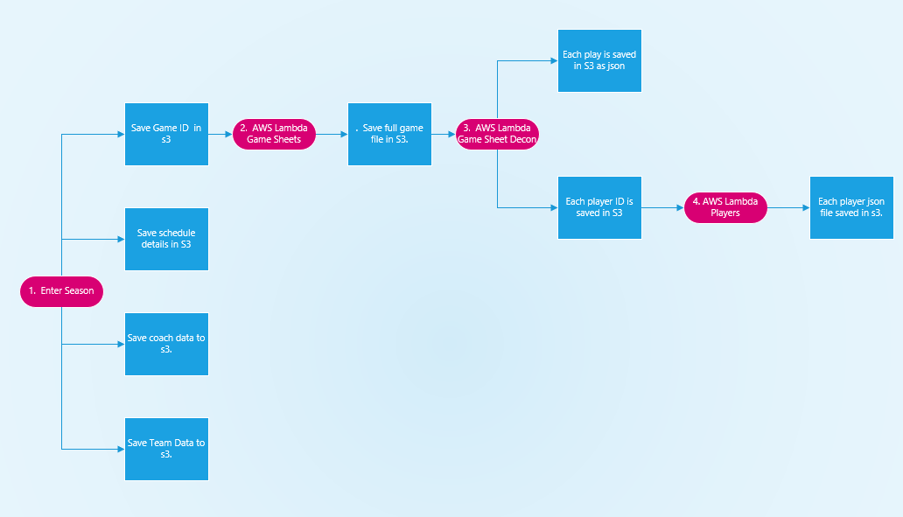
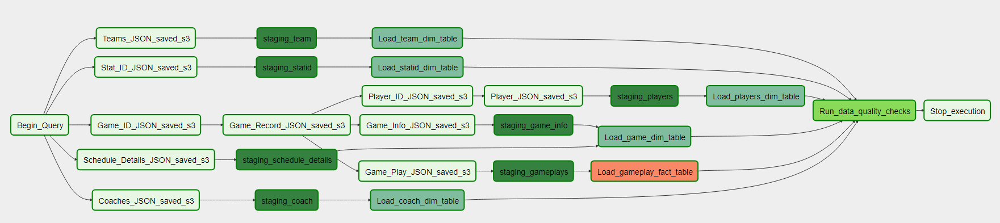

<h1> Data Engineering With NFL Data </h1>
 This is the capstone project for the Udacity Data Engineering Nanodegree.  This project will conduct ETL operations using NFL data.

<h2> Purpose</h2>
The purpose of this project is to take NFL data from a series of sources and combine them into a database.  An anylst will be able to query the database and get information such as the types of plays a player was involed in, the number of rushing yards, and the number of passing yards and touchdowns.  A person could use this data for general knowlege or incorporate into an analysis for fantasy football.  

<h2> Getting Started</h2>

<h3> Prerequisites</h3>
You will need the following python packages:

1.  **pandas**

2.  **boto3**

3.  **dotenv**

<h3> Running the code </h3>

1.  You will need to update the example.env file, the example cfg file will update itself if you use the included python files to create and delete the redshift cluster.  Save the example.env file as just .env and rename the exaple.cfg as vpconfig.cfg

2.  To create the redshift cluster use the following command:
> python create_red_cluster.py

3.  Next you will need to create the Redshift tables:
> python create_tables.py

4.  To conduct ETL operations from the data in the s3 buckets into the Redshift database you can use the provided scripts in Airflow or run the following command:
> python elt.py

5.  Example database queries have been provided in the redshift_query_examples notebook.

<h2> Project Step 1:Project Scope and Starting Data </h2>
This project will use data provided through the NFL endpoints.  The endpoint directory can be found here: <a href=http://www.nfl.com/feeds-rs?_wadl ">NFL</a>.  Once this data is stored it can be used for a variety of analytics.  This dataset could be used by players of fantasy football to evalutate their currently players and help to form possible trades as well as help people establish thier fantasy line up for the next week.  This can also be used by people who wish to compile all the highlight videos for any player.

Explain what end use cases you'd like to prepare the data for (e.g., analytics table, app back-end, source-of-truth database, etc.)

From this directory the following endpoints will be scraped to get the required data:

1. **Teams**:  The team data by year can be found at https://www.nfl.com/feeds-rs/teams/<year>.json.  For example the data for all NFL teams for the year 2000 can be found here https://www.nfl.com/feeds-rs/teams/2000.json.  The following data is provided from this endpoint:

<ul>
    <li>Season: Season of the record </li>
    <li>Team ID: A unique ID for each team in the NFL. </li>
    <li>Team Abbrievation: Commonly used team abbrievation for example the Denver Broncos is "DEN". </li>
    <li>City/State: How the team is identified by location for example the Denver Broncos is "Denver". </li>
    <li>Full Name: The full name of the team. </li>
    <li>Nickname: Commonly nickname for the team. </li>
    <li>Team Type: Used to annoate if the team is a regular season team or the "Pro Bowl Team" </li>
    <li>Conference Abbrievation, ID, and Full Name </li>
    <li>Division Abbrievation, ID, and Full Name </li>
    <li>Year Founded </li>
    <li>Stadium name </li>
    <li>Ticket Phone Number </li>
    <li>Team URL </li>
    <li>Team Ticket URL </li>
</ul>

2.  **Schedule**:  The full schedule for the entire year is posted at https://www.nfl.com/feeds-rs/schedules/<yeaer>.json.  For example the 2019 season can be found here https://www.nfl.com/feeds-rs/schedules/2019.json.  The only changes that are made during the year are for the post season game locations.  The following data is provided from this endpoint:

<ul>
    <li>Season: </li>
    <li>Season Type: This annotates if the is a preseason, regular season or post season game. </li>
    <li>Week: </li>
    <li>Game ID: A unique ID used for each game. </li>
    <li>Game Key: A unique ID used for each game </li>
    <li>Game Time Eastern: </li>
    <li>Game Time Local: </li>
    <li>ISO TIME: </li>
    <li>Home Team ID: </li>
    <li>Visitor Team ID: </li>
    <li>Home Team Abbr: </li>
    <li>Visitor Team Abbr: </li>
    <li>Home Display Name: </li>
    <li>Visitor Display Name: </li>
    <li>Home Nick Name: </li>
    <li>Visitor Nick Name: </li>
    <li>Game Type: </li>
    <li>Week Name Abbrievation: </li>
    <li>Week Name: </li>
    <li>Visitor Team, Season, Team ID, City/State, Full Name, Nickname, Team Type, Conference Abbr, Division Abbrievation: </li>
    <li>Home Team, Season, Team ID, City/State, Full Name, Nickname, Team Type, Conference Abbr, Division Abbrievation: </li>
    <li>Site ID, Site City, Site Full Name, Site State, Roof type, and network channel: </li>
</ul>

3.**Coaches** : Information for each coach for each team by year can be found at https://www.nfl.com/feeds-rs/coach/byTeam/<teamid>/<season>.json.  For example the Denver Broncos coach information for 2019 can be found here: https://www.nfl.com/feeds-rs/coach/byTeam/1400/2019.json.  This contains basic biographial information for each coach.  The following data is provided:

<ul>
    <li>NFLID: This is a unique ID used for coaches and players. </li>
    <li>Status: This indicates if the coach or player is active, retired, or free agent. </li>
    <li>Display Name: </li>
    <li>First Name: </li>
    <li>Last Name: </li>
    <li>ESBID: This is a unique ID used for coaches and players.  This number is also used to generate the url for the picture used. </li>
    <li>Birthdate: </li>
    <li>Home Town: </li>
    <li>Is Deceased: </li>
    <li>Current Status: This indicates if the coach or player is active, retired, or free agent. </li>
    <li>College ID: </li>
    <li>College Name: </li>
</ul>

4.**Players**:  Player information can be found at https://www.nfl.com/feeds-rs/playerStats/<nflId>.json.  The player information for Von Miller can be found at https://www.nfl.com/feeds-rs/playerStats/2495202.json.  While this site provides some statistical information for the player this project will only use the following:

<ul>
    <li>NFLID: This is a unique ID used for coaches and players. </li>
    <li>Status: This indicates if the coach or player is active, retired, or free agent. </li>
    <li>Display Name: </li>
    <li>First Name: </li>
    <li>Last Name: </li>
    <li>ESBID: This is a unique ID used for coaches and players. </li>
    <li>GSISIS: This is a unique ID used for coaches and players. </li>
    <li>Middle Name: </li>
    <li>Suffix: </li>
    <li>Birth Date: </li>
    <li>Home Town: </li>
    <li>College ID: </li>
    <li>College Name: </li>
    <li>Position Group: </li>
    <li>Position: </li>
    <li>Jersey Number: </li>
    <li>Height: </li>
    <li>Weight: </li>
    <li>Team ID: </li>
</ul>

5.  **Games**:  The site to get detailed game information can be found at https://www.nfl.com/feeds-rs/boxscorePbp/<gameid>.json.  An example for this data source can be seen at: https://www.nfl.com/feeds-rs/boxscorePbp/2016020700.json.  This data source will be used primarly to fill the fact table.  This json document is deeply nested.  As part of the data preprocessing the JSON document will be flattened to be placed in the staging table.  The field from this data source which will be used are:

<ul>
    <li>Season:  </li>
    <li>Season Type:  This indicates if the game is Preseason, Regular Season, or Post Season.</li>
    <li>Week: </li>
    <li>Game Id: This is a unique identifer for each game.</li>
    <li>Game Key: This is a unique identifer for each game.</li>
    <li>Game Date:  </li>
    <li>ISO Time:  </li>
    <li>Home Team ID: This the unique id for the home team</li>
    <li>Visitor Team ID: This is the unique id for the visitor team.</li>
    <li>Game Type: This is the common name for the game, it can be Preseason, Regular Season, or even SB for Superbowl.</li>
    <li>Phase: This indicates the current phase of the game.  Unless the game is currently in session this should read "FINAL"</li>
    <li>Visitor Team Score Total: </li>
    <li>Visitor Team Score Q1:</li>
    <li>Visitor Team Score Q2: </li>
    <li>Visitor Team Score Q3:</li>
    <li>Visitor Team Score Q4: </li>
    <li>Visitor Team Score OT: </li>
    <li>Home Team Score Total: </li>
    <li>Home Team Score Q1:</li>
    <li>Home Team Score Q2: </li>
    <li>Home Team Score Q3:</li>
    <li>Home Team Score Q4: </li>
    <li>Home Team Score OT: </li>
    <li>Drive Sequence: This is a unique identifer for the drive for this specific game.</li>
    <li> Play ID: This is a unique identifer for this play for this drive sequence.</li>
    <li> Scoring: This is a boolean value for this play resulted in a scoring drive.</li>
    <li> Scoring Team ID: This will indicate the ID of the scoring team if the play resulted in a score.</li>
    <li> Poession Team ID: This indeactes the ID of the team that currently on offense.</li>
    <li> Play Type: This is a catogrical variable which indicates the play type.  Most common forms are Pass, Rush, and Kick-off. </li>
    <li> Quarter: </li>
    <li>  Down: </li>
    <li>  Yards to Go: </li>
    <li>  First Down or Touch Down: </li>
    <li>  Play Stat Sequence: As a play can have multiple partipants this provides a unique value for each portion of a play. </li>
    <li>  Stat ID: This is the Stat ID of the play.  This can be cross referenced in the stat_codes.csv, which will be included as a dimension table.</li>
    <li>  NFLID: This the unique ID of the player involed with this specific portion o f the play.</li>
    <li>  Yards: This is the number of yards this player is responsible for.  If they player had no yards the value will be zero.</li>
    <li>  Play Description: This is the number of yards this player is responsible for.  If they player had no yards the value will be zero.</li>
    <li>  Play Video: If the play contains a highlight video there will be a direct link to the video here, <a href= "http://video.nfl.com/films/2015/GAME_HIGHLIGHT/in-game-highlight/NFLCOM/POST/22/160207_nfl_super_bowl_cmp_strip_sack_touchdown_410520_500k.mp4">this is an example.</a>  </li>
</ul>

5.  **STAT ID**:  This is a CSV containing the STAT ID codes and descriptions for each stat used in a game. The CSV can be seen here
 <a href= "./assets/statid_codes.csv ">STAT ID</a>.  The fields are described below.

 <ul>
    <li>STAT ID:  This is the unique identifer for each stat.</li>
    <li>Name:  This is the common name for the stat.</li>
    <li>Comment:  This is a detailed description of the stat.</li>
 </ul>

<h2> Step 2: Explore and Assess the Data </h2>

There are two primary problems with this dataset.  The first is gathering the data and the second is the primary dataset called games is a heavily nested json document and will require preprocessing before it can be loaded into a staging table.  To gather a all the required json files the following process was used.  

 

<h3> Step 1</h3>
 The data gathering process is intiaed with a python script where the user enters in the season of the NFL data they want to enter into the database.  The script code can be viewed in the access_raw_data jupyter notebook.  This script will execute four function functions

- The script will go to https://www.nfl.com/feeds-rs/schedules/<season>.json and do the following:
    - Save each Game ID as a seperate JSON in s3
    - Save Game detalied information in s3

- For each team in the NFL schedule for that season the script will go to https://www.nfl.com/feeds-rs/teams/<season_to_get>.json and get detailed information for each team for the season selected.  Each team will be saved as a seperate json in s3.

- For each team in the NFL schedule the script will go to https://www.nfl.com/feeds-rs/coach/byTeam/<team_id>/<season>.json and save a json file for each coach for each season.  The json file is saved by team, season, week.  If the script is run on a weekly basis it will be able to log coaching changes that occur during the regular season.

<h3> Step 2</h3>
The time to process a single season, deconstruct each game file save each play stat and player json file could easily take over an hour.  By using AWS Lambda this time can be reduced to minitues.  For step 2 for each gameid saved in s3 will start an AWS process which will download the complete game json and save it in another s3 bucket.  The only downside to this is each s3 prefix can only have one lambda trigger.  Also Lambda functions can run for a maxium of 15 minitues, so it is a best practice to keep Lambda functions simple.  It takes less than 30 seconds for Lambda to open each json file and download the game file and save it in the correct s3 folder.  The code for this Lambda function is saved in the lambda_functions folder under the name gameids.py.

<h3> Step 3</h3>
For each full game saved in s3, Lambda will launch and deconstruct each game saving each play stat as a seperate json file in s3.  This function will execute a second task of saving each player from the game as a single json document in a seperate json document.  The code for this function can be viewed in the lambda_functions folder under the name gamesheet_decon.py.

<h3> Step 4</h3>
For each Player ID saved Lambda will save the Player json file into an s3 bucket in a format that is ready to load into the Redshift staging table.  This Lambda code can be seen in the player_sheet.py file in the lambda_functions folder.

<h2>Step 3: Define the Data Model </h2>
The data model used is a simple star data model.  This data model works well as it is easy to query with quick speeds.  The table has not been taken to 3NF, while this increases redudancy it will result in faster return times on queries.  Once the data has been preprocessed and placed in the correct s3 folder it can be copied into the the staging table.  From the staging tables it will be inserted into the correct fact and dimension tables.

The mapping for S3 folder to staging table to fact or dim table is as follows:

s3://nfl-cap/coaches >> coaches_staging >> coaches_dim

s3://nfl-cap/gameinfo >> gameinfo_staging >> game_dim

s3://nfl-cap/schedules_details >> schedules_details_staging >> game_dim

s3://nfl-cap/gameplays >> gameplays_staging >> play_fact

s3://nfl-cap/player_info >> player_info_staging >> players_dim

s3://nfl-cap/statids/ >> statid_codes_staging >> statid_dim

s3://nfl-cap/teams >> team_staging >> team_dim

<h3>Staging Tables </h3>

There are seven staging tables for this project.  They can be seen in this <a href= "./assets/Staging Tables.pdf ">PDF</a>

<strong> Coaches Staging Table</strong>

| Field           | Data Type          |
 |-------------  | ------------------- |
| coach_id     | varchar                        |
| season         | int                        |
| week                 | varchar                        |
| display_name   | varchar                        |
| first_name   | varchar                        |
| last_name   | varchar                        |
| esbid   | varchar                        |
| status   | varchar                        |
| birthdate   | date                        |
| hometown   | varchar                        |
| collge   | varchar                        |
| team_id   | varchar                        |
| isdeceased   | varchar                        |
| pic_url   | varchar                        |

<strong> Game Info Staging Table</strong>

| Field           | Data Type          |
 |-------------  | ------------------- |
| game_id     | varchar                        |
| season         | int                        |
| season_type                 | varchar                        |
| week   | varchar                        |
| game_key   | varchar                        |
| game_date   | date                        |
| game_time_iso   | timestamp                        |
| vis_points_total   | int                        |
| vis_points_q1   | int                        |
| vis_points_q2   | int                        |
| vis_points_q3   | int                        |
| vis_points_q4   | int                        |
| vis_points_ot   | int                        |
| home_points_total   | int                        |
| home_points_q1   | int                        |
| home_points_q2   | int                        |
| home_points_q3   | int                        |
| home_points_q4   | int                        |
| home_points_ot   | int                        |
| win_team  | varchar                        |
|  lose_team | varchar                        |
| site_id  | varchar                        |
| site_city  | varchar                        |
| site_full_name  | varchar                        |
| site_state  | varchar                        |
| roof_type   | varchar                        |
| phase  | varchar                        |

<strong> Game Plays Staging Table</strong>

| Field           | Data Type          |
 |-------------  | ------------------- |
| game_id     | varchar                        |
| week         | varchar                        |
| drive_seq                 | varchar                        |
| play_id   | varchar                        |
| play_stat_id   | varchar                        |
| season   | int                        |
| home_team   | varchar                        |
| def_team   | varchar                        |
| off_team   | varchar                        |
| vis_team   | varchar                        |
| penalty   | varchar                        |
| scoring   | varchar                        |
| scoring_team   | varchar                        |
| play_type   | varchar                        |
| quarter   | varchar                        |
| down   | int                        |
| yard_to_go   | numeric                        |
| first_down   | varchar                        |
| play_descript   varchar                        |
| play_vid  | varchar                        |
|  stat_id | varchar                        |
| yards  | int                        |
| player_id  | varchar                        |
| player_team  | varchar                        |

<strong> Player Info Staging Table</strong>

| Field           | Data Type          |
 |-------------  | ------------------- |
| nfl_id     | varchar                        |
| esb_id         | varchar                        |
| gsis_id                 | varchar                        |
| status   | varchar                        |
| display_name   | varchar                        |
| first_name   | varchar                        |
| last_name   | varchar                        |
| middle_name   | varchar                        |
| suffix   | varchar                        |
| birth_date   | date                        |
| home_town   | varchar                        |
| college_id   | varchar                        |
| college_name   | varchar                        |
| position_group   | varchar                        |
| position   | varchar                        |
| jersey_number   | varchar                        |
| height   | int                        |
| weight   | int                        |
| current_team   | varchar                        |
| player_pic_url   | varchar                        |

<strong> Statid Code Staging Table</strong>

| Field           | Data Type          |
 |-------------  | ------------------- |
| stat_id     | varchar                        |
| name         | varchar                        |
| comment                 | varchar                        |

<strong> Schedule Details Staging Table</strong>

| Field           | Data Type          |
 |-------------  | ------------------- |
| game_id     | varchar                        |
| season         | int                       |
| season_type                 | varchar                        |
| week     | varchar                        |
| game_key         | varchar                        |
| home_id                 | varchar                        |
| vis_id     | varchar                        |
| game_type         | varchar                        |
| week_name_abbr                 | varchar                        |
| week_name                 | varchar                        |

<strong> Team Staging Table</strong>

| Field           | Data Type          |
 |-------------  | ------------------- |
| team_id     | varchar                        |
| season         | int                       |
| abbr                 | varchar                        |
| citystate     | varchar                        |
| full_name         | varchar                        |
| nick                 | varchar                        |
| team_type     | varchar                        |
| conference_abbr         | varchar                        |
| division_abbr                 | varchar                        |
| year_found                 | int                        |
| stadium_name                 | varchar                        |

<h3>Fact and Dim Tables </h3>
There are five dimension tables and 1 fact table.  They can be seen in this <a href= "./assets/Fact_Dim_table ERD.pdf ">PDF</a>

<strong> Coaches Dim Table</strong>

| Field           | Data Type          | Key          |
 |-------------  | ------------------- | ------------------- |
| coach_id     | varchar  | PRIMARY |
| season         | int     | PRIMARY |
| week     | varchar   | PRIMARY|
| display_name     | varchar   | |
| full_name   | varchar    | |
| last_name    | varchar    | |
| esbid     | varchar    | |
| birthdate    | date     | |
| hometown    | varchar   | |
| college   | int    | |
| team_id   | varchar  | |
| isdeceased   | varchar  | |
| pic_url   | varchar  | |

<strong> Players Dim Table</strong>

| Field           | Data Type          | Key          |
 |-------------  | ------------------- | ------------------- |
| nflid     | varchar  | PRIMARY |
| esbid         | varchar     |  |
| gsisid     | varchar   | |
| status     | varchar   | |
| display_name   | varchar    | |
| first_name    | varchar    | |
| last_name     | varchar    | |
| middle_name    | date     | |
| suffix    | varchar   | |
| birthdate   | date    | |
| hometown   | varchar  | |
| college_id   | varchar  | |
| college   | varchar  | |
| position_group   | varchar  | |
| position   | varchar  | |
| jersey_number   | varchar  | |
| height   | int  | |
| weight   | int  | |
| current_team   | varchar  | |
| player_pic_url   | varchar  | |

<strong> Game Dim Table</strong>

| Field           | Data Type          | Key          |
 |-------------  | ------------------- | ------------------- |
| game_id     | varchar                        | PRIMARY |
| season         | int                        | |
| season_type                 | varchar                        | |
| week   | varchar                        | |
| game_key   | varchar                        | |
| game_date   | date                        | |
| game_time_iso   | timestamp                        | |
| vis_points_total   | int                        | |
| vis_points_q1   | int                        | |
| vis_points_q2   | int                        | |
| vis_points_q3   | int                        | |
| vis_points_q4   | int                        | |
| vis_points_ot   | int                        | |
| home_points_total   | int                        | |
| home_points_q1   | int                        | |
| home_points_q2   | int                        | |
| home_points_q3   | int                        | |
| home_points_q4   | int                        | |
| home_points_ot   | int                        | |
| win_team  | varchar                        | |
|  lose_team | varchar                        | |
| site_id  | varchar                        | |
| site_city  | varchar                        | |
| site_full_name  | varchar                        | |
| site_state  | varchar                        | |
| roof_type   | varchar                        | |
| game_phase  | varchar                        | |
| week_name_abbr  | varchar                        | |
| week_name  | varchar                        | |
| game_type  | varchar                        | |
| home_id   | varchar                        | |
| away_id  | varchar                        | |

<strong> Team Dim Table</strong>

| Field           | Data Type          | Key          |
 |-------------  | ------------------- | ------------------- |
| team_id     | varchar                        | PRIMARY |
| season         | int                       | |
| abbr                 | varchar                        | |
| citystate     | varchar                        | |
| full_name         | varchar                        | |
| nick                 | varchar                    |     |
| team_type     | varchar                        | |
| conference_abbr         | varchar                        | |
| division_abbr                 | varchar                        | |
| year_found                 | int                        | |
| stadium_name                 | varchar                        | |

<strong> Stat ID Dim Table</strong>

| Field           | Data Type          | Key          |
 |-------------  | ------------------- | ------------------- |
| stat_id     | varchar                        | PRIMARY |
| name         | int                       | |
| comment                 | varchar                        | |

<strong> Play Fact Table</strong>

| Field           | Data Type          | KEY |
 |-------------  | ------------------- | ------------------- |
 | guid     | sequence                       |  PRIMARY|
| game_id     | varchar                        |  |
| week         | varchar                        |  |
| drive_seq                 | varchar                        |  |
| play_id   | varchar                        |  |
| play_stat_id   | varchar                        |  |
| season   | int                        |  |
| home_team   | varchar                        |  |
| def_team   | varchar                        |  |
| off_team   | varchar                        |  |
| vis_team   | varchar                        |  |
| penalty   | varchar                        |  |
| scoring   | varchar                        |  |
| scoring_team   | varchar                        |  |
| play_type   | varchar                        |  |
| quarter   | varchar                        |  |
| down   | int                        |  |
| yard_to_go   | numeric                        |  |
| first_down   | varchar                        |  |
| play_descript  | varchar                        |  |
| play_vid  | varchar                        |  |
|  stat_id | varchar                        |  |
| yards  | int                        |  |
| player_id  | varchar                        |  |
| player_team  | varchar                        |  |

<h2>Step 4: Run ETL to Model the Data </h2>

 

 The diagram shows the data pipeline in Airflow.  The process starts with a python command to get data for a NFL season, this is a dummy process in Airflow.  This will place initiate the Lambda processes listed in step 2.  Airflow will then copy the data from the s3 buckets to the staging tables.  Once this is complete the data will be copied to the fact and dimension tables.  Once all the insert commands run Ariflow will conduct a quality check to ensure all the dimension and fact tables have data.  Once this is complete Airflow will stop the process.

 <h2>Step 5: Complete Project Write Up </h2>
 The goal of this project was to build a database from NFL endpoints.  This database will allow people to conduct queries on players, teams, and coaches performances.  This can be used by NFL fans as well as those who play fantasy football to help plan thier team and track potential points.

 The primary tools for this project were Python, AWS Lambda, AWS s3, AWS Redshift, and Airflow.  AWS Lambda was used to help preprocess data that could take hours if done sequencially, by using Lambda this data preprocessing was reduced to mintues.  AWS s3 storage was used for the the json files as the storage is cheap and easily connects to AWS Lambda and Redshift.  AWS Redshift was used to store the data.  By using a column store distributed database, data should be readily avaible and returned quickly.  By using Airflow the ability to schedule the transfer of the data from S3 to staging tables and finally to the dimension and fact tables.  

 The data should be updated weekly on Tuesday morning.  This would enable the weeks games to be finsihed and the endpoint database to be finalized.  This data model works for the current size of the NFL database, but for some reason if this data was to increase by 100x it would be better to adjust the AWS Lambda to load get gameplay json loaded directly into the database.  If the decision to remiain with Redshift the size of the clusters would have to be increased, but it would be worth looking into Spark for database storage.  By moving to Spark it would also allow for an increase in users.  By using Airflow the database could easily be scheduled to run every day at 7 am and retrive the currents weeks NFL games.  This would be a very fast process using AWS Lambda and s3.
